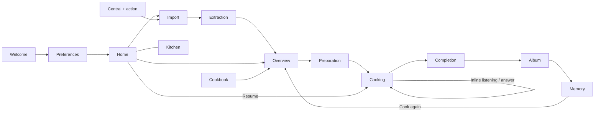

# Oui Chef — Berry / Deep Plum migration

Implementation and migration record · October 10, 2026

This migration follows the revised 16-screen specification and the four boards in `/Users/xie/Downloads/new_designs/`. The redesign is implemented in SwiftUI. The baseline assessment and migration decisions below explain the changes; the implementation status here distinguishes completed work from release validation. Existing files in `designs/design-review-2026-10-04/` are unchanged. The app was uploaded as TestFlight **1.0 (17)**; Apple is processing it. No backend, rules, or hosting deployment was performed. See the [release receipt](TESTFLIGHT.md#october-10-2026--berry--deep-plum-redesign-build-17).

## Implementation status

- Shared cream/plum/berry tokens, scalable editorial typography, native controls, one vector girl-chef master, and a matching opaque app icon.
- Welcome, three resumable onboarding stages, Home, Cookbook, import/progress, four-tab overview, ingredient preparation, active cooking, inline listening/replies, completion, Album, and Kitchen. Search stays on Home/Cookbook; the central + opens import. Cooking covers the tab navigation.
- Home prioritizes resuming and importing. Cookbook supports source/favorite/archive filters, rename, archive/restore, delete, and native sharing. General cooking questions open a small Home sheet.
- Preparation is a persisted cooking-session phase. Ingredients/equipment are checked within that session; review acknowledgements are tied to recipe version. Old sessions without preparation fields retain their previous cooking state.
- Known amounts scale from a retained baseline, including numeric step allocations. Original directions, temperatures, and timer durations are not silently rewritten. Unknown allocations are explicitly flagged. Adjustments are staged until accepted; cancel discards them. Users can optionally save the new portions to the cookbook.
- New imports retain source ingredients/actions/yield and the profile used during extraction. The overview can compare and restore source ingredients/instructions. Source restoration removes adapted preparation/cues that the source snapshot cannot support and requires review. Earlier imports without a source snapshot use the original attribution link.
- Future preparations use serving defaults and current allergy context. Changed taste, diet, equipment, or units produce an explicit review note; supported automatic adaptations still happen at import. The app does not claim it has safely re-adapted an old recipe offline. Existing session snapshots are preserved.
- Voice states distinguish connecting, listening, processing, speaking, muted, and error. Real microphone capture is shown separately. Audio response completion tracks playback draining; interruptions and route loss stop voice and preserve manual controls. Recipe-change tools propose a session note for explicit approval; they do not silently rewrite ingredients.
- Multiple timers retain independent deadlines and support pause/resume, extension, rename, cancellation, and review after expiry. Completion stops hands-free voice and saves history before optional notes, ratings, and photos.
- Photos are normalized/compressed before saving. Failed local edits roll back. New photo uploads retain the storage generation so removing an old photo cannot delete a concurrent replacement. Legacy photos without a generation are hidden on removal and retained in storage until replacement/account deletion.
- The retired catalog UI/store, full-screen voice flow, separate note/rating flow, and duplicate photo/cloud wrappers were removed. The ingredient catalog and legacy core/backend contracts remain where tests or compatibility still depend on them.

### Verification and visual review

Validation on October 10, 2026:

| Check | Result | Scope |
| --- | --- | --- |
| Swift core suite | 45 passed | Includes 11 migration checks for resumable preparation, old-session decoding, scaling/reset, source restoration, current preferences, timer rename, and invalid/oversized data. |
| Backend suite | 41 passed; 3 skipped | Includes source snapshots, general cooking help without a recipe, guarded photo deletion, and private-state exclusion from shared recipes. The three emulator-dependent checks were not run. |
| iOS simulator UI | 16 scenarios passed across the initial run and focused reruns | Welcome/email entry, onboarding, all tabs, URL/text entry, import progress/review, serving-review cancellation, archive/delete, sharing, checklist recovery, timers, optional memories, cook-again, inline voice/replies, manual fallback, and maximum accessibility text size. |
| Native build | Debug simulator build and signed Release archive passed | Xcode 26.6; app and Share Extension signatures verified. TestFlight 1.0 (17) uploaded successfully and is processing. |

The UI tests use explicit offline fixtures. They exercise the real SwiftUI controls and local cooking transitions, while authentication, extraction, and voice-provider responses are not live. The largest-text check includes a geometry assertion that the Next label stays inside its button; the rendered screenshot was also reviewed.

The Desktop checkout and Git objects were intermittently evicted by iCloud while the Mac was low on disk space. Native verification therefore ran from a source copy at `/private/tmp/ouichef-plum-local`, with build output at `/private/tmp/ouichef-plum-derived`. Changed app/configuration/UI-test files were compared byte-for-byte with the workspace. Original restored assets were checked against their Git blob hashes. No original recipe data or unrelated design files were removed. The initial full `git diff --check` stalled on evicted Git objects; after hydration and removal of a verified stale lock, the full staged check passed before committing. The source checkout and temporary build both remain available; iCloud may need to finish downloading other untouched files before a fresh build from Desktop.

Review captures are in [designs/berry-plum-implementation](../designs/berry-plum-implementation/). They show the implemented app, with sample recipe content:

| Experience | Capture |
| --- | --- |
| Welcome and setup | [Welcome](../designs/berry-plum-implementation/01-welcome.png) · [Dietary preferences](../designs/berry-plum-implementation/02-dietary-preferences.png) · [Taste](../designs/berry-plum-implementation/03-tastes-and-experience.png) · [Defaults](../designs/berry-plum-implementation/04-kitchen-defaults.png) |
| Home and import | [Home](../designs/berry-plum-implementation/05-home.png) · [Cookbook](../designs/berry-plum-implementation/06-cookbook.png) · [Import](../designs/berry-plum-implementation/07-import.png) · [Extraction](../designs/berry-plum-implementation/08-extraction.png) |
| Prepare and cook | [Overview](../designs/berry-plum-implementation/09-recipe-overview.png) · [Preparation](../designs/berry-plum-implementation/10-preparation.png) · [Current step](../designs/berry-plum-implementation/11-active-cooking.png) |
| Voice in context | [Listening](../designs/berry-plum-implementation/12-inline-voice-listening.png) · [Reply](../designs/berry-plum-implementation/13-contextual-chef-reply.png) · [Large text](../designs/berry-plum-implementation/cooking-accessibility-text.png) |
| Cooking memories | [Completion](../designs/berry-plum-implementation/14-completion.png) · [Album](../designs/berry-plum-implementation/15-cooking-album.png) · [Kitchen](../designs/berry-plum-implementation/16-your-kitchen.png) |

### Release requirements and deliberate limits

The user confirmed there are no Terms or Privacy URLs. `Configuration/Info.plist` now has empty `OuiChefTermsURL` and `OuiChefPrivacyURL` keys. Welcome/account display those links only when valid HTTPS destinations are supplied. Legal documents and hosting remain a release requirement; no placeholder destinations or invented consent were added.

Deploy the backend changes together with the new app before testing new extraction snapshots, general cooking help, and photo-generation cleanup against the hosted service. The controlled beta should move all testers to this compatible build; old clients can still drop new optional JSON fields when they overwrite records. No cloud records have been modified by this migration.

Physical iPhone validation remains necessary for real microphone permissions, spoken interruption, Bluetooth/route changes, background/lock-screen timers, notifications, and camera/Share Sheet flows. Preview voice states and sample answers are explicitly DEBUG-only test fixtures and do not prove a live audio connection. Live Apple/Google/email authentication and social-platform extraction are not revalidated by the simulator preview suite. Firebase rules/emulator checks remain separate.

P1/P2 features still deferred: recipe import from a photo/screenshot; arbitrary structural recipe editing by voice; automatic application of substitutions across future cooks; advanced cooking insights/recommendations/sharing. Contextual cooking photos, cooked-dish photos, source-video links, multiple timers, and notes/ratings are retained.

The boards are flattened PNGs. The app uses a single code-native vector interpretation of the specified girl-chef, with the same burgundy hair, side bun, white outlined hat, dot eyes, and neckerchief everywhere. A supplied original vector could replace this master without changing screen layout.

## 1. Recommendation

Rebuild the presentation of the existing native SwiftUI companion, while retaining its import, authentication, cooking-session, timer, voice, and persistence infrastructure. The current app already enters through `CompanionRootView`; a new application architecture or backend replacement would add work without improving the proposed experience.

The migration has three substantial functional changes alongside the visual work:

1. Keep the step, essential quantities, timers, and manual controls visible during every normal voice interaction.
2. Give Home a clear priority: resume the current cook, otherwise import a recipe, followed by recently saved recipes.
3. Make personalization visible, accurate, and reversible. A compact “2 servings · Less salt” summary must describe actual changes to the prepared recipe, not merely repeat profile preferences.

Build a connected, high-fidelity SwiftUI prototype of Home → Overview → Cooking, including voice states and Completion, before converting every screen. Use the existing offline preview mechanism and representative fixtures. Once the layout and interactions hold up, connect the new views to the existing store and expand to the remaining flows.

The scope can shrink substantially around discovery, developer diagnostics, standalone chat, and the retired catalog. It must preserve reliable cooking state, accurate recipe information, understandable voice controls, and the approved visual identity.

## 2. What the design boards establish

All four supplied files are flattened 1448 × 1086 PNGs. They are visual references, not editable layouts or production asset exports. The approximately phone-sized panels within each board do not supply reliable point measurements, font specifications, or isolated mascot/media assets.

| Board in Downloads/new_designs | What to retain | What to reconcile with the revised specification |
| --- | --- | --- |
| `ChatGPT Image Oct 10, 2026, 06_12_00 PM-1.png` | Expressive welcome photograph, plum editorial headings, quiet selection rows, segmented taste controls, three-step setup | Save onboarding progress; distinguish allergies from preferences; provide Back/Skip; use “Open my kitchen” at completion. Show only supported diet/equipment choices. |
| `ChatGPT Image Oct 10, 2026, 06_12_01 PM-2.png` | Compact cookbook rows with generous thumbnails, large import input, calm extraction stages, immersive recipe hero | This board omits Home and numbers Cookbook–Overview as 05–08. The revised specification places them at 06–09. Replace its Search tab with the revised navigation. |
| `ChatGPT Image Oct 10, 2026, 06_12_01 PM-3.png` | Scan-friendly ingredients, strong step hierarchy, source imagery, concentric plum microphone | Its full-screen Listening and response layouts are optional expansions. Default listening and answers remain inside Cooking. Ingredient Check–Chef Response become 10–13. |
| `ChatGPT Image Oct 10, 2026, 06_12_02 PM-4.png` | Brief celebration, personal dish photos, simple notes/rating controls, calm Kitchen rows | Merge Finished Cooking and Notes/Rating into screen 14. Album remains 15; Kitchen remains 16. A saved-source photo must not be presented as the user's finished dish. |

The written specification takes precedence over inconsistent board navigation, numbering, and interaction states. Sixteen named experiences do not require sixteen independent navigation destinations: Listening and Chef Response are Cooking states, while notes/rating are part of Completion and memory detail.

The board's herbs, tablecloth edges, handwritten captions, and device frames belong to the presentation. They should not become persistent in-app decoration. The app's fidelity comes from type, photographic crops, proportions, spacing, and consistent controls.

## 3. Pre-migration implementation: retain and correct

| Area | Evidence in current source | Migration implication |
| --- | --- | --- |
| Entry and navigation | `OuiChefApp.swift` opens `CompanionRootView`. `CompanionHome` already has Home, Cookbook, +, Album, Profile, with cooking in a full-screen cover. | Retain this structure, rename Profile to Kitchen, and make destination selection explicit. Do not implement the boards' Search tab. |
| Design system | `Theme.swift` uses olive/green, a cream background, fixed-size system serif headlines, an old gradient `VoiceOrb`, and generic card styling. | Replace semantic tokens and treatments. Recoloring alone will not achieve the boards' hierarchy, media treatment, or microphone design. |
| Onboarding | `CompanionPreferences` has three pages and structured profile selections; `page` and `draft` are view state, saved by `finish()`. Salt only offers Lower/Balanced. | Persist drafts and completed stage; support Back/resume and the specified Higher salt option. Preserve explicit allergy status and old preference review. |
| Home and cookbook | `CompanionHome` combines all destinations in one List. Home places search/import before unfinished cooks, includes recent dishes, and renders the full recipe grid. | Separate Home's task hierarchy from Cookbook. Prefer compact photographic rows for Cookbook, as in the board. Home should not duplicate the whole library. |
| Import | `CompanionImportView`, `CompanionStore`, and `backend/companion.mjs` already support URL/text, asynchronous jobs, cancellation, retry, evidence, attribution, and durable Share Sheet receipts. | Keep the pipeline. Simplify its presentation and route readiness to Review recipe. |
| Import completion | The ready-state button calls `store.start(recipe)` directly. `start` sets `reviewed = true`; it does not require a durable review decision. | Close this bypass before shipping the redesigned flow. Warnings and incomplete information need the same handling from every entry point. |
| Recipe overview | Hero, source link, Ingredients/Steps/Notes, favorites, sharing, deletion, warnings, and history exist. Adaptations appear under Notes. | Add visible adjustment summary and Source tab; consolidate secondary toolbar actions; add serving edits and explicit review where needed. |
| Preparation | `checked` is local `@State`; the attempt is created after preparation. Equipment is labeled “optional” even when the recipe requires it. | Persist preparation in the attempt. Distinguish optional equipment preference collection from required equipment for a specific recipe. |
| Cooking | `CookAttempt` owns snapshot, progress, independent timers, events, messages, changes, and completion. Timer expiry does not complete steps. | Preserve these semantics. Redesign their display and introduce a compact persistent timer/voice area. |
| Voice | `CloudVoice` supports audio transport and interruption of speech. `CompanionStore` exposes a Boolean plus status string; `toggleVoice` requires an active cooking screen. | Introduce explicit view states, preparation context, and inline answers. Actual processing/microphone state needs transport events, not a decorative animation. |
| Contextual questions | `RecipeQuestionView` opens a sheet, stops voice, clears `lastAnswer`, and has separate photo/text input. Opening source media also stops voice. | Bring question entry and answers into Cooking; keep intentional photo/media expansion. Preserve conversation and explain any audio pause. |
| Personalization | Backend extraction applies supported preferences and records `adaptations: [String]` and evidence. `record_change` records prose; it does not edit ingredients or instructions. | Preserve source values and introduce structured before/after changes before promising undo or “Apply this substitution.” |
| Completion and album | Finished attempts already save without photos. Notes/rating use a sheet. Album records are attempts, so repeat cooks have independent histories. | Keep that model. Improve the visual flow, add cook-again and photo removal, and make “Back to my cookbook” actually select Cookbook rather than only dismiss cooking. |
| Imagery | A welcome photograph, source thumbnails, and private covers exist. `RecipeStep` has a video timestamp but no step-image asset. `Assets.xcassets` has no approved chef mascot. | Obtain one mascot master. Display step imagery only when it exists and is relevant; layout must work beautifully without it. |
| Tests | `CompanionTests` and `CompanionFlowTests` cover the active product. Some companion tests deliberately assert shortcuts now being replaced. Older UI suites target the retired catalog. | Update assertions to the new contract and port still-relevant authentication/voice behavior tests before retiring obsolete screen tests. |

Source locations: [current views](../OuiChef/App/CompanionViews.swift), [store](../OuiChef/App/CompanionStore.swift), [active models](../OuiChef/Core/Companion.swift), [profile](../OuiChef/Core/CookProfile.swift), [import/extraction](../backend/recipe-agent.mjs), [voice](../OuiChef/App/CloudVoice.swift).

## 4. High-fidelity design contract

### Color, typography, and dimensions

Start with the supplied colors as exact tokens; adjust only after reviewing rendered screens and contrast. Name them by purpose so a brand change does not leave usages named `green` throughout the app.

| Token | Initial value | Usage |
| --- | --- | --- |
| Background | `#FAF5EE` | Main warm cream surface |
| Brand | `#4A102A` | Primary actions, selected navigation, editorial headings |
| Accent | `#A34865` | Selected details and voice feedback |
| Soft accent | `#F3DFE2` | Listening rings and restrained conversational panels |
| Text | `#282326` | Instructions and readable body copy |
| Sage | `#A9B69A` | Occasional ingredient accents; not small text on cream |
| Supporting tokens | Define after contrast review | Secondary text, separators, disabled controls, warning/error surfaces |

Proposed starting dimensions are design decisions, not measurements extracted from the boards:

- Editorial serif: approximately 36–40 pt for primary titles, 28–34 pt for cooking action headlines, and 22–26 pt for sections. Let long titles wrap naturally.
- Contemporary sans-serif: 17–18 pt cooking instructions, 15–17 pt ingredient rows and controls, 12–13 pt metadata. Small uppercase stage labels remain secondary information.
- Use the current native serif as the first prototype baseline and SF sans for utility text. Compare actual glyph shapes and line breaks to the boards before accepting it; bundle a properly licensed alternative only if needed. No script font for instructions or controls.
- Base horizontal inset 24 pt, reduced on small devices where necessary; spacing scale 4/8/12/16/24/32. Large headlines should create hierarchy without consuming the entire first viewport.
- Primary actions approximately 52–56 pt tall. Minimum interactive target 44 × 44 pt, with 48–56 pt preferred around cooking controls. Keep actual hit regions generous even when the icon is small.
- Rows should share a surface and use whitespace or subtle separators. Reserve larger rounded containers for a meaningful grouped action, voice response, or timer. Use roughly 12–16 pt row corners and 20–24 pt image/panel corners, then tune in the prototype.
- Support Dynamic Type using scaled styles; do not cap text size to preserve a screenshot. Large accessibility sizes can stack quantity rows and reduce or hide optional imagery.

These are app-specific design targets informed by Apple's guidance on text resizing, contrast, visible alternatives to audio cues, and accessible controls: [Accessibility](https://developer.apple.com/design/human-interface-guidelines/accessibility) and [Dynamic Type](https://developer.apple.com/videos/play/wwdc2024/10074/).

### Photography and mascot

Use edge-to-edge hero photography on Welcome, Overview, and Completion where appropriate. Cookbook thumbnails should have a consistent crop, while Album emphasizes the user's photo. Provide a quiet, intentional missing-photo layout; never fill all recipes with the sample pasta photograph.

Step media must depict the relevant technique or source moment. Do not use a finished-dish hero as a doneness reference, and do not invent footage or present generic generated imagery as an observation of the user's food. Ingredients can use restrained icons until a coherent illustration set exists; mismatched emoji would weaken the design.

Produce one reusable approved mascot asset: burgundy hair and side bun, white outlined chef hat, dot eyes, small smile, neckerchief. Obtain a clean vector master or faithfully redraw one selected reference, then export from that master. Reuse it at all sizes; independently generating a character for every screen would lose identity. The supplied boards do not contain a standalone production-quality master.

The mascot belongs on Welcome, a small onboarding callout, extraction, optional voice expansion, and Completion. It should not occupy space needed for cooking quantities or timers. Voice rings are flat concentric plum/blush shapes surrounding a microphone; motion is subtle, state-driven, and respects Reduce Motion.

### Reusable UI, kept small

Implement only the components needed by the first five experiences: typography/color/spacing tokens, primary action, editorial image treatment, recipe row, ingredient row, selection row, voice dock, timer summary, chef answer, and memory editor. Keep these local to the app. Avoid a general design-system framework or a view model per screen.

## 5. Navigation and the five experiences to validate first

Primary navigation is **Home · Cookbook · + · Album · Kitchen**. The plus presents Import without changing the selected tab. Search lives in Home and Cookbook. The tab bar disappears for preparation and active cooking. Returning from an overlay preserves the selected step, scroll position where practical, timers, and transcript.

Recipe links and Share Sheet results land in Overview. Their origin does not bypass review or activate the microphone automatically. A resumed preparation attempt returns to Ingredient Check; a resumed cooking attempt returns to its current step. If multiple attempts exist, Home promotes the most recently used unfinished attempt and offers a compact way to reach the others.

| Experience | Proposed layout and behavior | Prototype acceptance |
| --- | --- | --- |
| Home | Small greeting; prominent Resume when a cook exists, otherwise Import a recipe; secondary import remains easy to reach; contextual search; a short recently-saved section with See all; bottom navigation | First action is obvious in empty, populated, importing, and active-session states. No discovery feed or full library duplicated here. |
| Overview | Immersive hero; title/source; time and servings; compact “Your adjustments” row; Ingredients/Steps/Notes/Source; required equipment and review issues; pinned Start cooking | User can identify the dish, quantities, changes, source, and any reason to review before starting. Adjustment details open only on request. |
| Active Cooking | Step count/progress; stage; large action headline; full instruction and step quantities; cue/media when available; persistent timer summary; Previous, Complete step, and microphone | The current action and essential controls remain usable with long text, no media, and multiple timers. Completing and browsing are distinct operations. |
| Voice interaction | Compact microphone/rings plus explicit state; short transcript/answer expands inline; timer summary and current step remain visible; optional expanded conversation | Speak, interrupt, mute, retry, and return without losing the step. Permission/network failures retain manual cooking. The design never implies capture while the microphone is off. |
| Completion | Brief celebration, recipe title, optional personal photo; expandable note/rating/photo editor; saved state; Back to cookbook | Completion is saved before optional input. Leaving without a photo or rating still creates an Album item. Cookbook button reaches Cookbook. |

Test these as one connected sequence with representative home cooks, not only as five isolated pictures. Include a long recipe title, a 10+ ingredient recipe, a missing image, a review warning, and two timers. Ask participants to import, explain an adjustment, find the current quantity while listening, recover after muting, and finish without a photo. A small formative round of 3–5 target users can reveal interaction problems; it is not a statistical validation claim.

## 6. Screen-by-screen migration map

| Spec screen | Implement from | Required change |
| --- | --- | --- |
| 01 Welcome & Sign-In | `CompanionWelcome`, `AccountView`, `AccountSession` | Recompose photography and serif headline, add small approved mascot and real Terms/Privacy destinations, present Apple/Google/email consistently, preserve errors/loading/account linking. |
| 02 Dietary Preferences | `CompanionPreferences`, `PreferenceChecklist` | Quiet rows, separate allergy selection, clear unspecified/none-known/selected states, save draft/progress, Back/Skip. Keep catalog search; support an explicit custom restriction instead of silently dropping unlisted needs. |
| 03 Taste & Experience | Same profile flow | Spice, Lower/Balanced/Higher salt, dislikes, experience; concise explanation; persist each accepted stage. |
| 04 Kitchen Defaults | Same profile flow and `CookProfile` | Servings/household/units/language, optional equipment including Stovetop, awake/reminder settings; grouped controls; complete with Open my kitchen. |
| 05 Home | `CompanionHome` | Dedicated import/resume hierarchy, recent saves, contextual search, clear first-import state. General no-recipe chef assistance is deferred below. |
| 06 Cookbook | Current recipe list/filter/favorite logic | Photographic rows, search by name/ingredient, simple favorite/source filters; menu for rename/archive/delete; preserve source and cooking history. |
| 07 Import | `CompanionImportView` | One main URL/text input and action; supported source wording; Share Sheet explanation; remove inactive photo-upload promotion until implemented. |
| 08 Extraction | Existing job listener/progress | Separate visual state within import; genuine pipeline stages; leave/return/cancel/retry; ready action opens Overview; diagnostics leave the consumer flow. |
| 09 Overview | `CompanionRecipeView` | Hero-led layout, Source tab, visible/reversible changes, serving edits, review issues, required equipment, clear Start/Resume choice. Difficulty can remain absent when unknown. |
| 10 Ingredient Check | Current preparation branch | Session-backed checks, pantry disclosure, required tools and preparation, missing-item acknowledgement when relevant, scoped chef assistance, one ready action. |
| 11 Current Step | `CompanionCookingView` | Recompose for legibility, compact persistent timer summary and voice dock; manual Previous/Complete controls; source media only when available; preserve progress. |
| 12 Listening | New presentation of existing voice connection | Inline state by default, plum rings, real microphone status, stop/mute, transcript when available, optional expansion. |
| 13 Chef Response | Current `lastAnswer`, messages, question transport | Inline actionable answer, spoken output, conversation history, follow-up, confirmed actions; current step stays visible. |
| 14 Completion | `CompanionCompletion`, `AttemptDetailView`, photo view | One completion flow with reusable optional memory editor; actual saved status; one-photo add/replace/remove; preserve approved changes; correct return destination. |
| 15 Album | `AttemptTile`, `AttemptDetailView`, history | Editorial gallery/list, date/rating/note, polished no-photo state, recipe access and cook again; each cook remains independent. |
| 16 Kitchen | Current profile and preferences/account sheets | Profile/stats; focused Cooking preferences, Kitchen defaults, Voice, Language, Import history, Notifications, Privacy/account entries. Keep account deletion and existing sign-in recovery. |

## 7. Voice interaction contract

Replace `voiceEnabled + voiceStatus` as the presentation source with a small explicit state model: inactive, connecting, listening, processing, speaking, muted, error. Also track actual microphone capture separately: a connection can be processing or speaking while capture remains enabled for interruption. The visible label must tell the truth about that distinction.

| State | Feedback | Available action |
| --- | --- | --- |
| Inactive | Neutral mic; Tap to talk | Explicitly start voice |
| Connecting | Quiet progress + Connecting; microphone status shown accurately | Cancel |
| Listening | Plum rings + Listening; recent transcript when supplied | Mute/stop |
| Processing | Restrained pulse + Thinking; retain question and step | Mute/stop; allow interruption if capture is active |
| Speaking | Speaker + short answer; show whether microphone remains on | Interrupt response, mute microphone, or end voice |
| Muted | Crossed mic + Microphone off | Explicit resume |
| Error | Short actionable explanation and retry; manual cooking remains | Retry or open Settings for permission |

Implementation rules:

- Keep one voice connection and one cooking state owner. Listening/response views must not instantiate a second session or reset focus.
- Add the missing processing/speech lifecycle events through the existing provider-neutral transport. Do not infer “Listening” from a view animation or a socket connection alone.
- Show the most recent answer close to the current instruction, with further conversation in an optional expansion. Do not automatically push the instruction offscreen or scroll away from it.
- Text/photo questions use the same session context and conversation. Preparation supplies the prepared recipe, selected quantities, profile, checklist, and phase. A photo picker can temporarily expand; returning restores cooking.
- Retain short spoken answers and interruption support. For the initial version, muting can stop the live connection while retaining conversation locally; do not build a complex background audio service to preserve a socket.
- Direct, unambiguous commands such as “next step” or “set a three-minute timer” are explicit intent. Avoid a second confirmation for every command. Ambiguous timer targets, assistant-proposed recipe changes, and consequential inferred actions require an explicit user decision.
- Current tool handling trusts a model-supplied `confirmed` flag. For proposed recipe modifications, create a pending change tied to the session and revision, display/read the change, then apply only after user acceptance. Do not treat that flag alone as evidence of acceptance.
- Retain action IDs, revision checks, duplicate suppression, and manual equivalents. Updating UI text must never be the mechanism that changes recipe state.
- Add timer rename to the existing timer/action model and provider tool schema; preserve deadlines when renaming. Keep multiple timers because they are already implemented.
- End listening on completion, leaving cooking, account switch, or backgrounding. Return in a clearly inactive/muted state and require explicit resume. Timers continue from persisted deadlines.
- Validate actual iPhone behavior for calls/Siri, Bluetooth changes, speaker echo, locked-screen notifications, denied permissions, network failure, and reconnect. The active `CloudVoice` has engine-configuration handling, while the legacy `GuidedVoice` includes a separate interruption observer; do not assume the active path inherits it.

Apple documents explicit interruption and route-change handling through `AVAudioSession`; these need real-device validation in this app: [audio interruptions](https://developer.apple.com/documentation/avfaudio/handling-audio-interruptions), [route changes](https://developer.apple.com/documentation/avfaudio/responding-to-audio-route-changes).

## 8. Data changes and compatibility

Keep the existing account-specific archive, sync outbox, conflict preservation, import jobs, and Firestore paths. Domain concepts need clear boundaries; they do not each need a new collection.

| Concept | Existing representation | Minimum useful extension |
| --- | --- | --- |
| User Profile | `CookProfile`, `users/{uid}/settings/cooking` | Onboarding draft/stage, custom restrictions, missing choices, explicit voice behavior settings. Preserve explicit allergy status. |
| Saved Recipe | `CompanionRecipe`, `users/{uid}/cookbook/{id}` | Original normalized source baseline when available; structured adaptation metadata; rename/archive metadata; optional trustworthy difficulty/media. |
| Adaptation | `adaptations: [String]`, ingredient substitution text, attempt `changes` | Stable target IDs, original/adjusted values, reason, proposed/applied/rejected status, approval origin and time. Keep original explanatory text for legacy recipes. |
| Recipe Step | `RecipeStep` and textual `StepIngredient.quantity` | Structured step quantity allocations where known, plus optional supported media reference. Keep full instructions and existing stable IDs. |
| Cooking Session | `CookAttempt`, `users/{uid}/cooks/{id}` | Preparation/cooking phase, checked ingredient/equipment IDs, review acknowledgements tied to recipe version, profile snapshot, selected servings/units, approved adaptations, actual cooking start time. |
| Cooking Memory | Finished `CookAttempt` with notes/rating/photo | Continue using the completed attempt. Add editing/removal and recipe access; avoid a second independently synced memory record. |

### Preparation and review

Create or resume an attempt when entering Ingredient Check, so preparation belongs to the session. The ready action transitions that same attempt to cooking. Separate preparation creation time from cooking start time so the reported cooking duration remains meaningful.

For old unfinished attempts, default the new phase to cooking; finished attempts remain completed based on `finishedAt`. An Overview visit alone should not create an unfinished cook. Offer Resume for an existing attempt and a secondary Start new cook action. Cooking again from Album creates a new attempt using the saved recipe/current preferences; the old attempt remains immutable apart from its editable memory fields.

Missing checks do not automatically mean an ingredient is unavailable. Let users continue unchecked preparation without repetitive prompts; acknowledge a declared missing essential ingredient or an unresolved review issue once. Allergy conflicts need prominent, specific review and an understood resolution/limitation, not a blanket “safe” badge. Show warnings even if the affected ingredient is classified as a pantry basic.

Move review enforcement into the shared start/transition operation used by Overview, import completion, and recipe links. A `reviewed` Boolean set by `start` cannot establish that the user reviewed the recipe. If the recipe version or relevant allergy context changes, invalidate the affected acknowledgement. Missing critical instructions must be resolved before starting; minor unknowns can remain explicit and acknowledged.

### Reversible personalization and quantities

The existing extractor already builds a source plan before personalization. Extend that contract to retain a usable original baseline and structured changes. Do not regenerate an alleged original from the already adapted recipe. Old records without an original remain readable; offer the source and an explicit re-import if restoration is unavailable.

For the first full migration, automatically apply supported numeric serving/unit changes and clearly represented existing non-structural adjustments. Ingredient substitutions and equipment-dependent method changes remain suggestions until explicitly approved. Broader automatic rewriting is a later enhancement.

Changing servings must update both the ingredient list and step allocations from the same baseline. `StepIngredient.quantity` is currently free text, so scaling only `RecipeIngredient.amount` would create contradictory instructions. Add structured amounts where supported; handle free-text quantities, ranges, “to taste,” and unknown yields explicitly. Preserve source wording, surface unresolved in-instruction quantities for review, and never silently apply a regular expression to every number in prose. Do not scale temperatures or cooking durations by portion count, or convert volume to weight without valid ingredient-specific information.

The Overview summary is derived from applied changes. It opens a small detail sheet for original/adjusted values, reasons, and reset/override. Changes made for this cook are session-specific; “Use next time” explicitly saves a recipe default. Profile changes affect future preparation, not historical attempts or an active cook without consent.

### Migration safeguards

- Add explicit schema versions and backward-compatible decoding. Swift synthesized `Codable` does not make new nonoptional stored properties backward-compatible merely because they have initial values; use optional fields or `decodeIfPresent` defaults.
- Test old profile/recipe/session/local-archive fixtures. Preserve unknown source values, existing photos, active deadlines, notes, and old prose adaptations.
- Decode into a candidate archive before replacing the saved file. Preserve the old file on failure; do not silently replace an unreadable archive with an empty kitchen.
- Update Swift models, extraction schema, validators, import cache version, question/voice context, recipe sharing, fixtures, and size checks together. Recipes currently have a 180,000-byte/string-size bound in relevant validation/rules; duplicating source payloads indiscriminately could exceed it.
- Mixed app versions are a real issue: current clients write complete JSON payloads and can discard new fields. For the current controlled beta, move testers to a compatible build before enabling schema-dependent writes. A broader mixed-version rollout needs writer-version enforcement or a field-preserving server write contract first.
- Preserve current revision-conflict recovery and deletion tombstones. Test photo ownership/path behavior when a conflict creates a new attempt. Do not reset Firebase data to achieve a visual migration.
- Ship additive backend support before dependent clients. Rollback must retain new data rather than run an old writer against it; use a forward fix or disable the new mutation path if needed.

## 9. Keep, remove, and defer

### Keep working capability

Keep Firebase authentication/account cleanup, import queue and source verification, URL/text import, source attribution, Share Extension receipts, recipe sharing links, local recovery/outbox, recipe snapshots, multiple timers, notification scheduling, voice transport, photo compression/upload, and independent cooking history. Existing P1 capability does not need removal merely because it is labeled P1 in the specification.

Keep the current provider integration. This task does not require a model/provider switch, new state-management framework, new database, or a cross-platform rewrite.

### Remove from the new experience

- Standalone full-screen listening as the default, and a separate general-chat destination.
- Home's full-library grid and competing recently-cooked feed; Album owns cooking memories, Cookbook owns the full library.
- Default-on consumer import diagnostics, raw transcripts, extraction metadata, and the Kitchen “Debug mode” toggle. Keep diagnostic access in developer builds/tools, with source attribution still available to users.
- Inactive “Upload a photo — Coming soon” UI until image recipe import works.
- Dense recipe toolbar actions: move rename/archive/share/delete into a menu, retain the accessible favorite control.
- Legacy chef/category discovery, recipe sets/entitlements UI, ratio-tuning screens, and old recovery screens that are outside the current import-first product.
- New-user phone sign-in promotion. Retain access/re-authentication for existing phone-linked accounts until account usage and migration are checked.

### Concrete deletion candidates and dependencies

The root app no longer references the old `ChefStore` UI path. After the shared dependency moves and regression checks, remove this retired app flow together:

`ChefStore.swift`, `KitchenView.swift`, `OnboardingView.swift`, `CookingView.swift`, `IngredientCheckView.swift`, `IngredientPickerView.swift`, `RecoveryView.swift`, `VoiceSessionView.swift`, `GuidedVoice.swift`, `FirestoreCatalog.swift`, `DishHistory.swift`, and `DishCloud.swift`.

`DishPhotoView.swift` is also a candidate **after** moving its `compressed` utility to the live photo path: both `CompanionStore.attachPhoto` and `RecipeQuestionView` call it. Preserve its orientation normalization, size bound, and removal of source metadata.

Do not delete `Recipe.swift`, `IngredientCatalog.swift`, or bundled ingredient resources wholesale. `CookProfile` uses `IngredientLibrary` for selection lists; it depends on `Food`, and shared live code uses `CookingError` currently declared in `Recipe.swift`. Isolate these shared types and validation first. `PreferenceChecklist.swift` also contains the live `CookingTextEntry` used for timers and change notes.

After that separation, trace the old graph-cooking core (`CookingSession`, `AdaptiveCooking`, `CompletedDish`, `KitchenStorage`, old `Preferences`/`VoiceRequest`), catalog-only types/resources, `Tools/CatalogValidate`, and their tests for a second deletion batch. Keep any explicit compatibility reader still required by installed builds. Re-run callers after each batch; being unreachable from today's root is not proof a backend endpoint or stored format has no users.

Retire obsolete UI assertions only after porting relevant authentication, timer, voice, and data-loss protection cases. Do not delete backend catalog endpoints, rules, tools, or voice-access migration during the UI cutover: `backend/server.mjs` still routes catalog publication, and `AccountSession` uses the legacy voice-access claim path. Remove those separately once compatibility is established. Preserve recipe-sharing hosting and current account/security rules.

### Explicitly deferred beyond the first redesign release

| Feature | First-release decision |
| --- | --- |
| No-recipe Home chef shortcut | Defer until the no-session question/voice contract exists. Do not fake a recipe or silently attach an unrelated active cook. Preparation and cooking assistance remain in scope. |
| Screenshot/image recipe import | Defer; URL/text and the existing Share Sheet cover the primary import journey. |
| Embedded source-video player | Keep working attributed source links/timestamps. Add inline playback only for sources whose media access supports it. |
| Step-image generation and broad ingredient artwork | Defer. Use supported source media and a polished text-only layout. |
| Automatic structural recipe/equipment adaptations | Suggestions and explicit approvals first; no unsupported claim that every recipe can adapt to every kitchen. |
| Multiple dish photos per memory | Keep one editable photo initially, including remove/replace. |
| Memory favorites, complex filters/comparisons | Start with date/title/note/rating and cook again. |
| Skill progression, recommendations, household collaboration | Out of this migration. |

Cookbook rename/archive and timer rename are small concrete additions to the current model and can fit the full redesign. Archive must be reversible; the current server-only `recipeArchive` used during deletion is not a user-facing archive feature.

## 10. Implementation sequence and exit criteria

| Stage | Deliverable and main files | Exit criterion |
| --- | --- | --- |
| A — Design foundation and prototype | `Theme.swift`, approved mascot asset, representative preview fixtures; five connected experiences using the current debug-preview entry | Side-by-side review matches the boards' character; revised navigation and inline voice work; small/large text and no-image layouts remain usable. User testing identifies no unresolved obstacle in the core cooking journey. |
| B — Compatible state contracts | `CookProfile.swift`, `Companion.swift`, `CompanionStore.swift`, extraction/voice schemas and tests | Old records decode; preparation/review persist; original/adapted values are honest; serving/step quantities stay consistent; migration preserves histories and deadlines. |
| C — Browsing and import | Root/home/cookbook/overview/import portions of `CompanionViews.swift`, Share Extension/deep-link callers, focused UI tests | Every import route reaches review; Home prioritizes resume/import; cookbook search/favorite/rename/archive/delete work; no debug content in consumer screens. |
| D — Preparation, cooking, voice | Preparation/cooking views, voice dock and answer panel, `CloudVoice.swift`, `CompanionStore.swift`, `backend/xai.mjs` and event translation | Step/context remain visible; voice states reflect reality; manual fallback works; multiple timers and resume survive interruptions; consequential changes receive real acceptance. |
| E — Onboarding, completion, personal kitchen | Preference flow, reusable memory editor, Album/Kitchen, account presentation | Onboarding resumes; completion always saves; optional memory editing is frictionless; cook again creates a new attempt; settings affect future preparation. |
| F — Cleanup and release validation | Retired app path and shared-type extraction; affected tests/config/docs; full target build | No dangling callers; app and Share Extension build; core/backend/UI checks pass; migration and physical-device checklist pass. |

Stages B and C can be interleaved within small vertical slices, but persistent review/preparation behavior must exist before the full cooking flow ships. Stage A is a quality gate: building all remaining screens before it passes risks spreading the wrong type scale, photo proportions, or voice layout.

Split `CompanionViews.swift` by flow as each flow is replaced: onboarding, home/cookbook, import, overview/preparation, cooking/voice, memories, and Kitchen. Keep `CompanionStore` as the initial persistence/action authority. A small typed tab selection and explicit presented route are enough to avoid overlapping sheets; do not introduce a general router framework. Do not create separate databases or stores for Listening, Chef Response, and Cooking Memory.

The first implementation change should deliver the design tokens, master mascot integration, and five-state preview slice. The next change should establish durable preparation and review. This order makes both fidelity and the most important behavior changes reviewable before a broad rewrite.

## 11. Acceptance and verification

Use tests where behavior changes; use screenshot/device review for visual fidelity. Do not write tests that merely repeat color constants or SwiftUI markup.

| Area | Required verification |
| --- | --- |
| Migration | Decode old/missing-field fixtures; restart with an existing cook, paused/running timers, photo, and dirty outbox; preserve source/history when recipes are renamed, archived, or deleted; reject stale actions; inspect mixed-version writes. |
| Onboarding/account | New, returning, skipped, and interrupted onboarding; explicit allergy states; unusual restrictions; Apple/Google/email paths and existing phone-linked re-authentication; account switching clears private state. |
| Import/review | URL, pasted text, Share Sheet, recipe-sharing link; leave/return; cancellation/retry; blocked source, quota, insufficient content; warning review cannot be bypassed. Progress reflects actual stages rather than a fabricated percentage. |
| Personalization | Original vs adjusted values; reset; unknown yield/amount; step allocations; profile change after import; custom recipe override; no mutation of historical attempts; unsupported automatic change stays a suggestion. |
| Preparation | Persist partial ingredient/tool checks after leaving and relaunching; pantry warnings remain visible; missing essentials are actionable; ready transitions the same session exactly once. |
| Cooking/timers | Previous vs reopen; repeated rests; duplicate timer requests; two timers across different steps; rename/pause/resume/extend/cancel; app background/relaunch; expiration does not advance; finish saves once and ends voice. |
| Voice | Every state plus actual capture status; interruption of speech; denied permission; network timeout/disconnect; stale/duplicate actions; ambiguous timer selection; accepted/rejected recipe proposal; inline/photo question preserves focus and conversation. |
| Memory | Finish without photo/note/rating; add/replace/remove photo; edit memory; cook again; source recipe deleted; offline save followed by sync; correct destination on Back to cookbook. |
| Visual/accessibility | All 16 named experiences and key empty/error states; compact and large iPhones; default and accessibility text sizes; VoiceOver reading order and labels; Reduce Motion; usable keyboard layouts; adequate contrast and one-handed hit areas. |
| Hardware | Physical iPhone microphone and speaker, Bluetooth connect/disconnect, call/Siri interruption, app lock/background, timer notifications with permission both allowed and denied, Share Sheet from representative installed apps. |

Core and backend commands remain `swift test` and `npm test --prefix backend`. Run the active `CompanionFlowTests` against the simulator with new assertions for this flow; build the main app and Share Extension. Rules/account/photo checks use isolated Firebase emulators. Live social import and real microphone tests are separate acceptance work, not something a passing preview test proves.

Replace the shared-link UI test's expectation of immediate voice cooking with Overview → reviewed Preparation → explicit voice activation. Replace tests that accept temporary ingredient state with persistence checks. Port relevant cases from `AccountFlowTests`, `VoiceFlowTests`, and `CookingFlowTests` before removing their retired-screen assumptions.

Capture a fresh review set from the implemented app, using representative recipes and source-supported media. Compare against the new boards at the same device/content size; do not judge fidelity by tint alone. Preserve the existing October 4 review files as the before reference.

## 12. Inputs still needed before visual sign-off

The plan can proceed with the supplied palette and native serif/sans baseline. Final fidelity requires one mascot master, an accepted headline font, and agreed photographic crops. Real Terms and Privacy URLs/content also need to exist before the welcome screen can be considered complete; no destinations were found in the current welcome/account UI.

The assessment above drove the local implementation recorded at the top of this document. Deployment, live-provider checks, exact source-vector delivery, and physical-device audio acceptance remain outside the automated preview checks.
